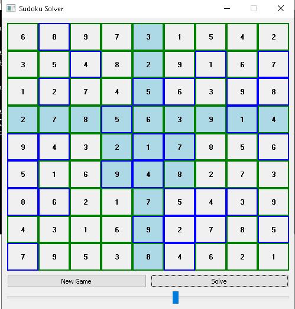

# sudoku_solver

This is a small GUI application built in Python3 and Pyqt5 to solve sudoku boards. It is also possible to use it as a game.
The approach used to solve and generate boards is backtracking.

*The main purpose of this project is to visualize how backtracking algorithms work.

 

In the application:
  * Press on "New game" button to generate a board with a unique solution:
    This will generate a random board with no control over the number of blank cells to start with.
    
    - Initial cells (blue-bordered) are non-changable. For the other cells to fill, you just move the mouse
      over that cell and press a number from your keyboard. something to note is that, the board will does not accept values that
      creates invalid states(i.e. number dublicates in a row, column or the corresponding 3x3 square).

    - to get a hint of what number should be in the cell just click on it with the mouse. The number will fill that cell automatically.
    - to remove previously assigned numbers, enter 0 in that number's cell.
    
   * Press on solve, and the board will start solving, and here you can visualize the backtracking algorithm. (I already have the solution as it is unique)
   
     - The solver will ignore your input and solve according to the initial state.
     - The slider at the bottom is to control the speed of the solving visualisation.
     
   * There is an exe file in the repo, and it is a single executable file for the application.
    
  

